<div align="center">
  
</div>

## Table of Contents

1. [Purpose](#Purpose)
2. [Demo](#Demo)
3. [Setup](#Setup)
4. [Technologies Used](#Technologies)
5. [Related Projects](#Related)

## Purpose

The goal of this project for our team of engineers was to replicate a website called **HipCamp** and build a "campsite detail page." Individually, we worked on separate widgets to create a similar user interface/experience to the actual website. I was in charge of implementing the second portion of the overview section that included, but were not limited to, a modal, photogrid, and a pop-up carousel. One of most exciting about my module was that it heavily relied on the use of CSS flexbox and grid layouts. To learn more about the finished product, explore the links and screenshots provided in the section below.

## Demo

<p float="left"><b>Full demo:</b> https://youtu.be/IN7jjsxXM3E</p>
<p float="left"><b>Timestamp for my module (from 1:01 to 1:48):</b> https://youtu.be/IN7jjsxXM3E?t=61</p>

Screenshots to compare **my product** to the **actual website**:

| My App | HipCamp |
|:------:|:-------:|
|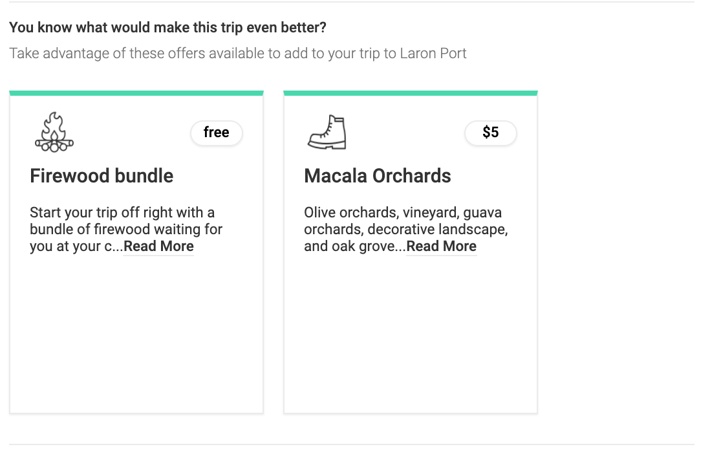 | 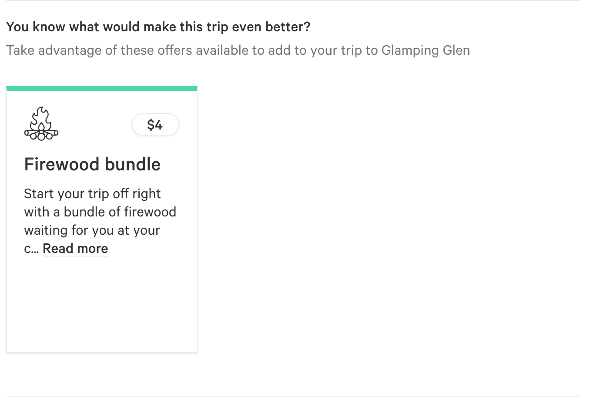
|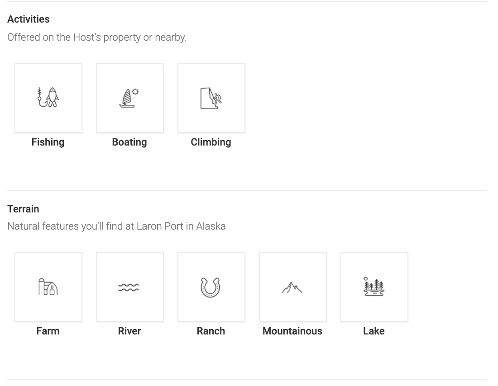 | 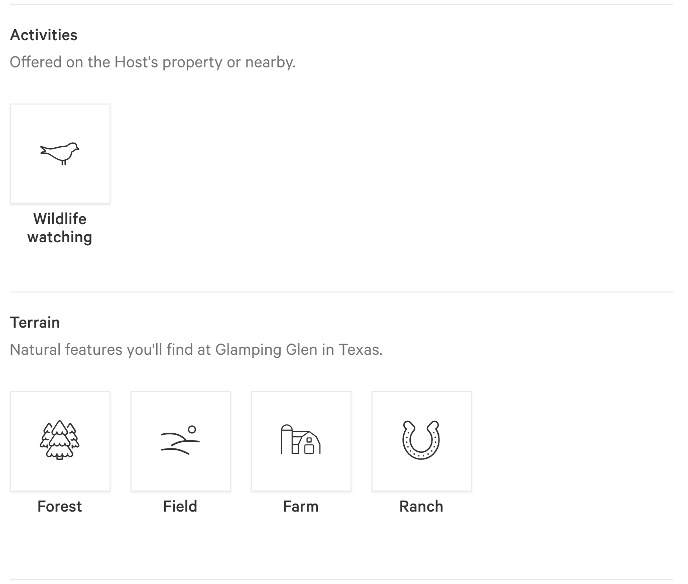
|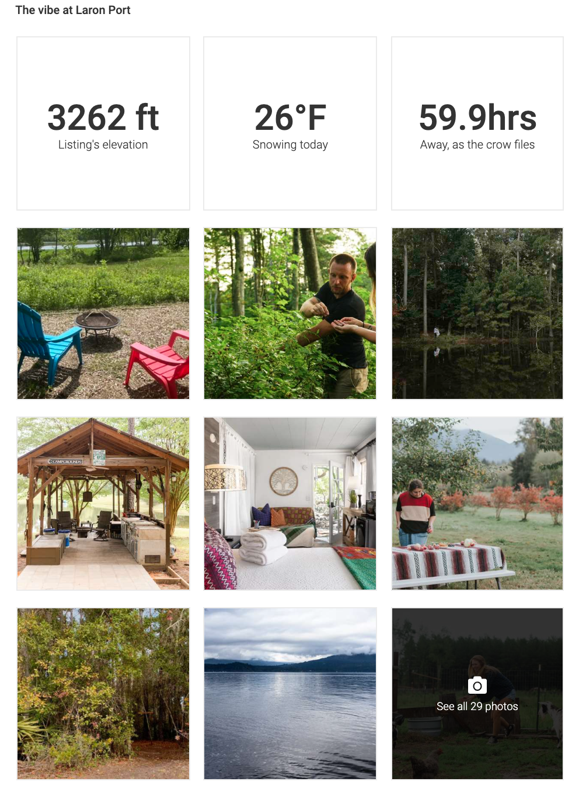 | 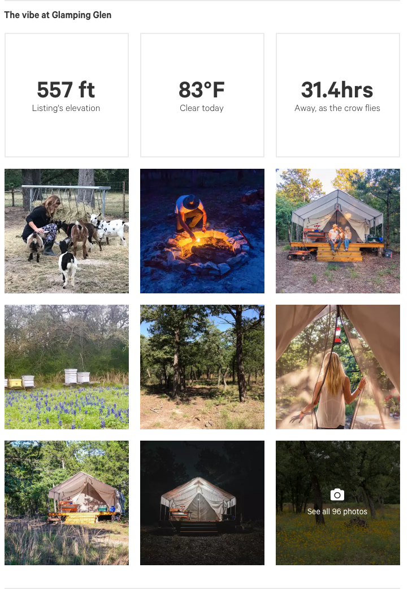
|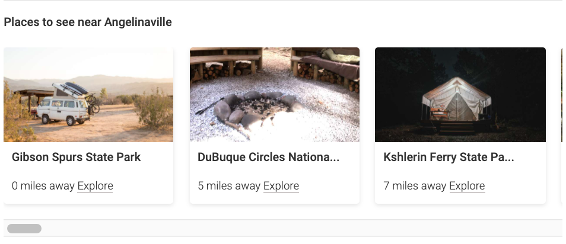 | 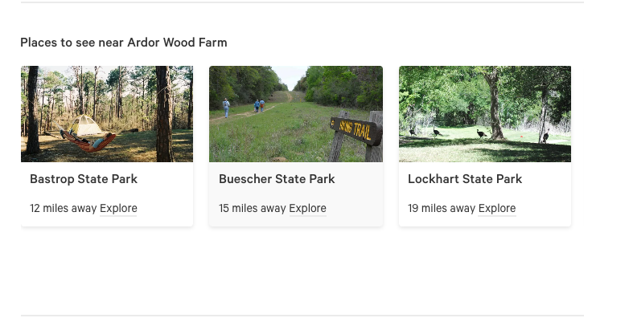
|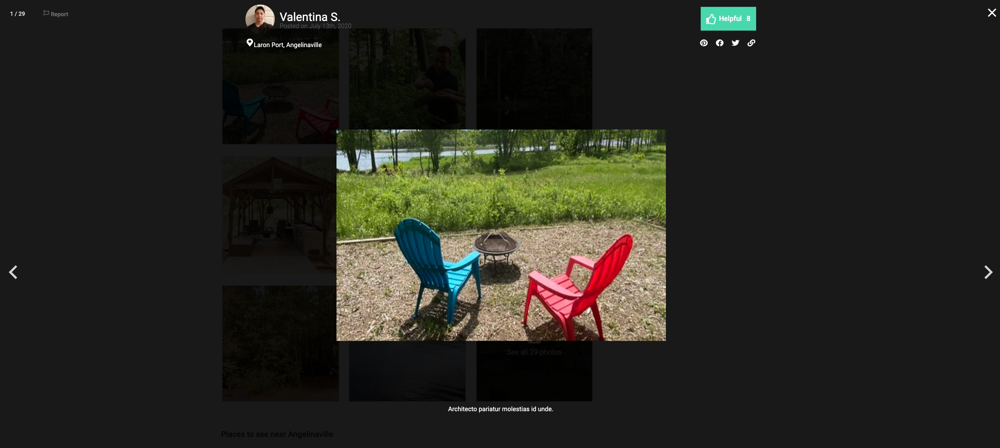 | 
|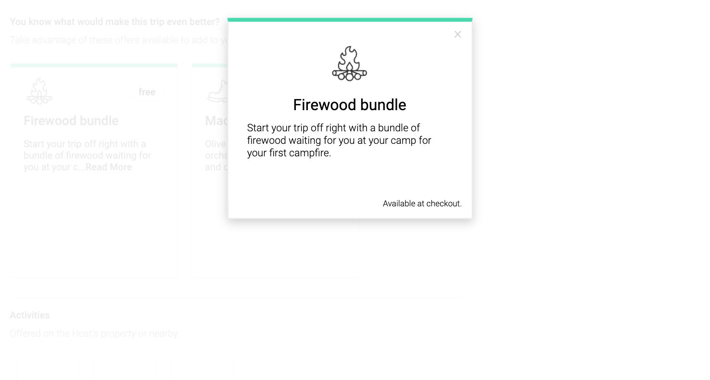 | 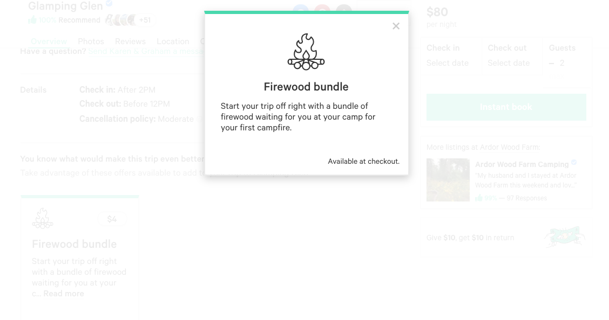

Link to a campsite page on HipCamp: https://www.hipcamp.com/texas/ardor-wood-farm/glamping-glen

## Setup

Open up the terminal and from within the root directory, install the dependencies by running the command:

```sh
npm install
```

Rename the configExample.js to config.js and input the password for your MySQL server if you have one. Then navigate to the database directory. Make sure that your MySQL server is running and seed the schema file with the command:

```sh
mysql -u root -p < schema.sql
```

Go back to the root directory and run the following seeding function scripts to import data into your database:

```sh
npm run seed
npm run seed2
npm run seed3
npm run seed4
npm run seed5
npm run seed6
```

Run these scripts to start the server and serve the static files:

```sh
npm run build
npm start
```

Open up your browser and navigate to http://localhost:3003/

Every refresh/reload will render a random campsite!

## Technologies

| Technologies Used |
|-------------------|
| React |
| CSS3 |
| Axios |
| MySQL |
| AWS S3 & EC2 |
| Node.js |
| Express.js |

## Related

  - https://github.com/Go-Tim/nick-nav
  - https://github.com/Go-Tim/tracy-detail-desc-calendarsticky
  - https://github.com/Go-Tim/nick-reviews
  - https://github.com/Go-Tim/tim-suggestions